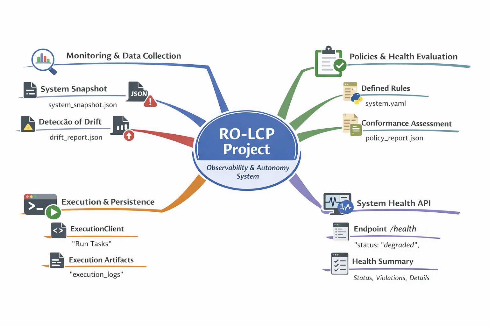

RO-LCP

Local System Health, Explained Like the Real World

RO-LCP makes Linux system health observable, predictable, and auditable — without dashboards, agents sprawl, or external services.

What is RO-LCP?

RO-LCP is a local system health monitoring framework built on top of Ralph Orchestrator ($RO).

Instead of traditional monitoring tools that rely on always-on services and centralized collectors, RO-LCP works like a digital inspection process:

Agents observe the system

Results are written as artifacts

Outputs are checked against clear rules (contracts)

Decisions are deterministic and reproducible

No black boxes. No external dependencies.

Real-World Analogy

Think of RO-LCP like a factory quality inspection:

Sensors check machines (CPU, memory, disk)

Each inspection produces a written report

Reports are validated against official standards

Only real, meaningful issues are flagged

This same pattern is applied to your Linux system.

## Architecture Overview

  

What RO-LCP Does

Collects real CPU, memory, and disk metrics

Stores every snapshot as a verifiable JSON artifact

Validates outputs against contract-first specifications

Detects system drift using deterministic policies

Runs 100% locally, offline-friendly

How It Works (Simple Flow)

Snapshot Agent
Collects system metrics at a point in time

Artifact Generation
Metrics are stored as immutable JSON outputs

Contract Validation
Outputs are checked against a formal spec

Policy Evaluation
Drift is evaluated to decide if action is required

Agents never talk directly to each other — artifacts are the only source of truth.

Why This Is Different

Traditional monitoring answers:

“What is happening right now?”

RO-LCP answers:

“Is the system behaving within agreed, provable limits — and can we prove it later?”

This makes it ideal for:

Auditable environments

Deterministic systems

Autonomous infrastructure

AI-driven operations

Running Locally
ralph run

That’s it. No SaaS. No credentials. No collectors.

Policies (Drift Rules)

Policies define when change actually matters.

They are written in YAML and evaluated against system artifacts.

Example
cpu:
  max_drift_percent: 20

memory:
  min_free_mb: 24000

disk:
  min_free_gb: 15

Project Status

v0.1 — Complete (audited via RO)

v0.2 — In progress (policies + alerting)

v0.3 — Planned (self-healing workflows)